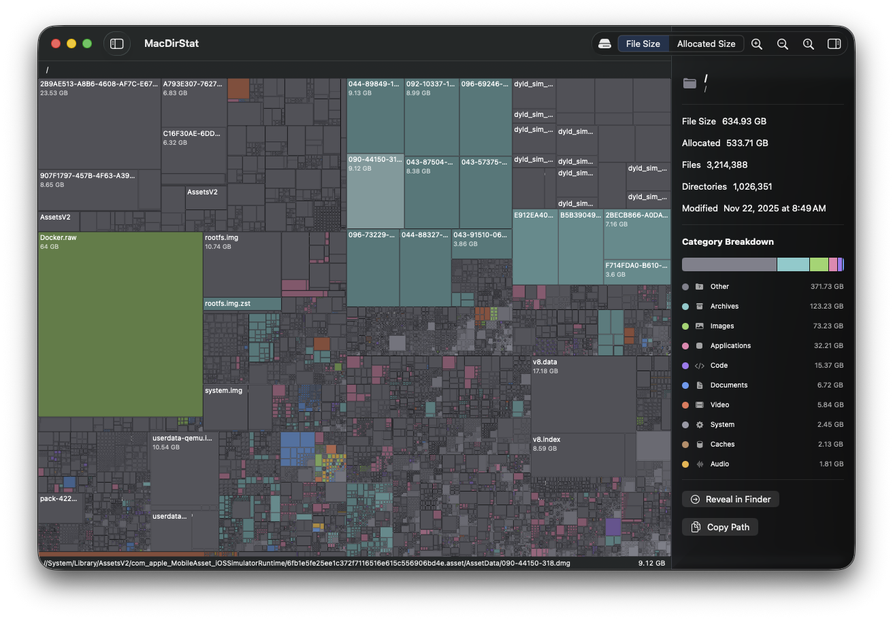

# MacDirStat

**Free, open-source disk space analyzer for macOS — like [WinDirStat](https://windirstat.net/), but native to the Mac.**

Find out what's eating your storage with interactive treemap visualizations, just like WinDirStat and WizTree on Windows. MacDirStat is a fast, lightweight, native macOS app built with SwiftUI — no Electron, no subscriptions, no tracking.



## Why MacDirStat?

- **Free and open source** — no paywall, no trial limits, no ads
- **Native macOS app** — built with SwiftUI, feels right at home on your Mac
- **Fast scanning** — uses low-level BSD `fts` APIs for speed that beats FileManager-based tools
- **Zero dependencies** — nothing to install, no runtimes, no frameworks to download
- **Privacy-first** — runs entirely offline, never phones home

If you've used **WinDirStat**, **WizTree**, or **TreeSize** on Windows and want the same experience on macOS, MacDirStat is the answer. It's also a great free alternative to **DaisyDisk**, **GrandPerspective**, and **OmniDiskSweeper**.

## Features

- **Interactive Treemap Visualization** — Squarify algorithm renders directories and files as proportionally-sized, color-coded rectangles
- **Directory Tree Sidebar** — Hierarchical outline view for browsing the file tree alongside the treemap
- **File Inspector** — Detail panel showing file size, allocated size, file/directory counts, modification dates, and a category breakdown chart
- **Breadcrumb Navigation** — Drill down into subdirectories and navigate back via breadcrumb bar
- **10 File Categories** — Documents, Images, Video, Audio, Code, Archives, Applications, System, Caches, and Other — each with distinct colors
- **Size Metric Toggle** — Switch between file size and allocated (on-disk) size
- **Volume Picker** — Launch screen shows mounted drives with usage bars, or scan any custom folder
- **Zoom & Pan** — Scroll to zoom into dense treemap regions
- **Reveal in Finder** — Jump to any file or folder directly from the inspector
- **Copy Path** — One-click path copying to clipboard

## Installation

### Build from source

Requires macOS 15.0+ and Swift 6.

```bash
git clone https://github.com/phalladar/MacDirStat.git
cd macdirstat
swift build -c release
swift run MacDirStat
```

Or open in Xcode:

```bash
open Package.swift
```

Zero external dependencies. Pure Swift Package Manager project.

## Architecture

MacDirStat is built with SwiftUI and Swift 6 strict concurrency. A single `@Observable` **AppState** drives all views.

**Scan pipeline:** User picks a folder → **ScanCoordinator** launches **FileScanner** → FileScanner uses BSD `fts_open`/`fts_read`/`fts_close` for fast traversal → streams `ScanEvent`s via `AsyncStream` → coordinator throttles UI updates at 50ms intervals → treemap renders.

### Project Structure

```
Sources/MacDirStat/
├── App/              # Entry point, AppState
├── Scanning/         # FileScanner (BSD fts), ScanCoordinator, FileNode tree model
├── Categorization/   # FileCategory definitions, 200+ extension mappings
├── Treemap/          # Squarify layout engine, Canvas renderer, hit testing
├── Views/            # ContentView, WelcomeView, DirectoryTreeView, DetailPanelView
└── Utilities/        # ByteFormatter
```

## Contributing

Contributions are welcome! Open an issue or submit a pull request.

## Related Projects

- [WinDirStat](https://windirstat.net/) — the original Windows disk usage analyzer
- [WizTree](https://diskanalyzer.com/) — fast disk space analyzer for Windows
- [GrandPerspective](https://grandperspectiv.sourceforge.net/) — treemap disk visualizer for macOS
- [DaisyDisk](https://daisydiskapp.com/) — commercial macOS disk analyzer
